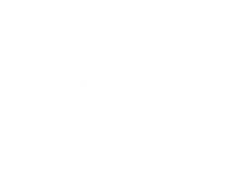

<p align="center"></p>


## About Plastic Omnium

The story of Plastic Omnium is an industrial and human adventure, full of the spirit of entrepreneurism and innovation. Today, that story enables us to take on the latest technological challenges of the automobile sector with enthusiasm and ambition.
Find out about the innovations and major events that form our identity.

## This Project

This app is built using Inertiajs/vue 3, laravel, tailwindcss, with a MySQL database.
before you start working on the project make sure you run the following commands:
```bash
$ composer update
$ npm update
$ php artisan migrate:fresh
$ php artisan serve
$ npm run dev
```


## Technologies

<p align="center">
<a href="https://github.com/laravel/laravel">
    
</a>

<a href="https://github.com/inertiajs">
    
</a>
</p>

## Assets
<a href="https://sortablejs.github.io/vue.draggable.next/#/table-example">https://sortablejs.github.io/vue.draggable.next/#/table-example</a>
<br>
<a href="https://gridstackjs.com/">https://gridstackjs.com/</a>
<br>
<a href="https://flowbite-vue.com/https://flowbite-vue.com/">https://flowbite-vue.com/</a>
<br>
<a href="https://vue-multiselect.js.org/#sub-getting-started">https://vue-multiselect.js.org/#sub-getting-started</a>
<br>
<a href="https://vue-search-select.netlify.app/#/model">https://vue-search-select.netlify.app/#/model</a>
<br>
<a href="https://www.svgrepo.com/">https://www.svgrepo.com/</a>
<a href=""></a>
<a href=""></a>
<a href=""></a>